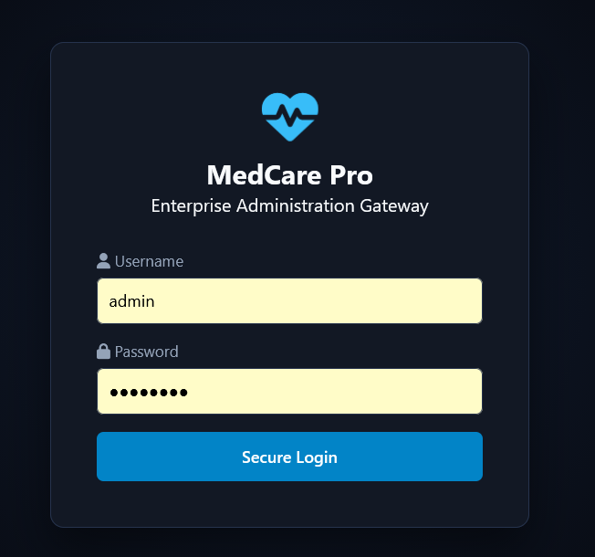
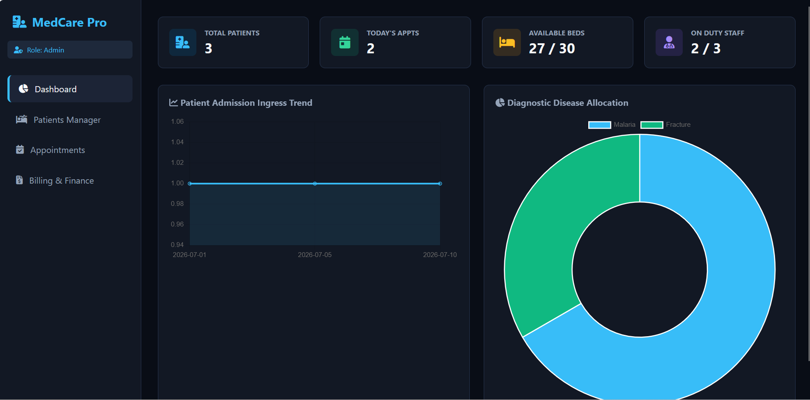
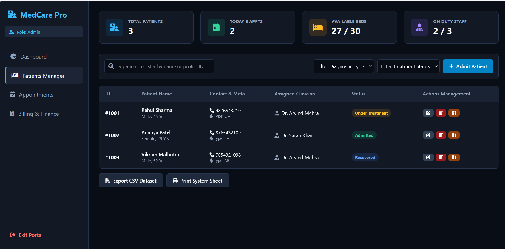
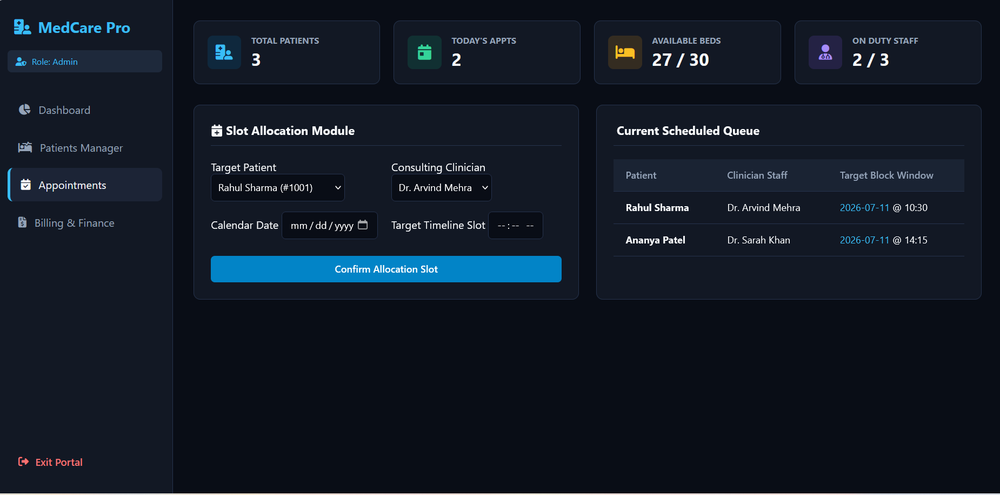
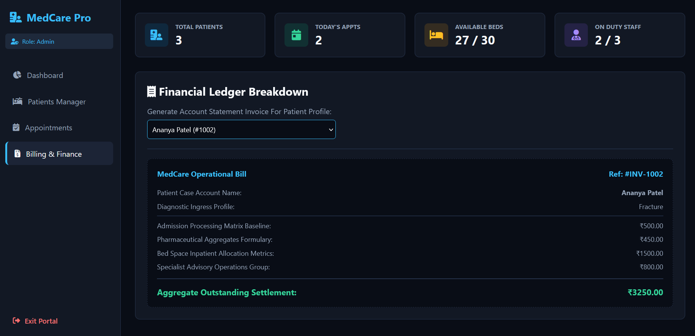

# 🏥 MedCare Pro


> A modern Hospital Management System built using **HTML, CSS, and JavaScript**.


---

## 📖 About the Project

**MedCare Pro** is a responsive Hospital Management System designed to simplify hospital operations through an easy-to-use web interface.

The project demonstrates front-end web development skills including responsive layouts, user interface design, and JavaScript-based interactivity.

---
## 🌐 Live Demo

🔗 https://saloni-bhati-tech.github.io/MedCare-Pro/

## ✨ Features

- 👨‍⚕️ Doctor Management
- 🧑 Patient Registration
- 📅 Appointment Scheduling
- 📊 Dashboard
- 📱 Responsive Design
- ⚡ Fast and Interactive UI

---

## 🛠 Tech Stack

| Technology | Purpose |
|------------|---------|
| HTML5 | Structure |
| CSS3 | Styling |
| JavaScript | Functionality |

---

## 📂 Project Structure

```text
MedCare-Pro/
│
├── index.html
├── style.css
├── app.js
└── README.md
```

---

## 🚀 Getting Started

1. Clone this repository

```bash
git clone https://github.com/saloni-bhati-tech/MedCare-Pro.git
```

2. Open the project folder.

3. Open `index.html` in your browser.

---

## 📸 Screenshots

### Login Page



---

### Dashboard



---

### Patient Management



---

### Appointment Module



---

### Billing Module



## 👩‍💻 Developer

**Saloni Bhati**

🎓 B.Tech - Health Informatics

🏫 VIT Bhopal University

📧 bhatisaloni20@gmail.com

---

⭐ If you like this project, consider giving it a star.